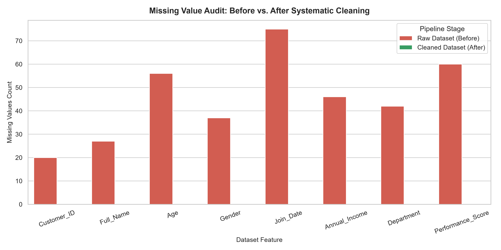
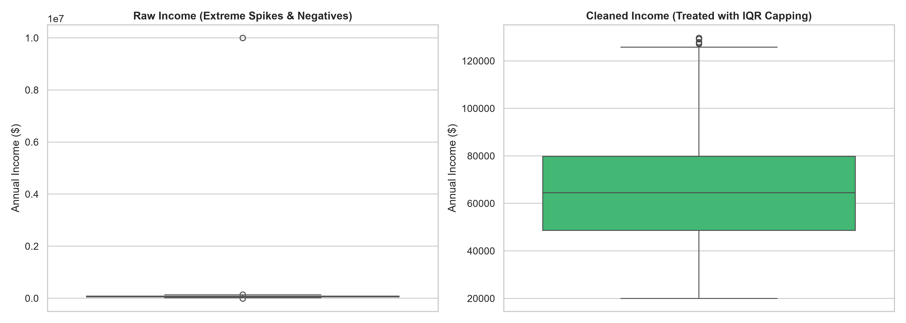

# 🧹 Systematic Data Cleaning & Quality Audit Pipeline

**Organization:** Oasis Infobyte (OIBSIP)  
**Track:** Data Analytics (Level 1 • Task 3)  
**Author:** Narendra

---

## 📌 Project Overview
This project builds a systematic data cleaning and transformation pipeline that converts an uncurated dirty dataset into a production-ready asset. It handles duplicate removal, categorical harmonization, mixed-date parsing, currency symbol extraction, IQR outlier treatment, and statistical imputations.

---

## 📁 Repository Structure
```text
├── charts/
│   ├── missing_values_audit_comparison.png
│   └── outlier_treatment_before_after.png
├── data/
│   ├── raw_dirty_dataset.csv
│   └── cleaned_dataset.csv
├── notebooks/
│   └── data_cleaning_pipeline.ipynb
├── report/
│   └── findings_and_recommendations.md
├── run_cleaning.py
├── requirements.txt
└── README.md
```

---

## 📈 Quality Audit Visualizations

### 1. Missing Value Audit (Before vs. After)


### 2. Outlier Treatment & Distribution Sanitization


---

## 📄 Technical Audit Report
For the complete Before-vs-After data quality audit metrics, see **[report/findings_and_recommendations.md](report/findings_and_recommendations.md)**.

---

## 🚀 How to Run Locally
```bash
pip install -r requirements.txt
python run_cleaning.py
jupyter notebook notebooks/data_cleaning_pipeline.ipynb
```
